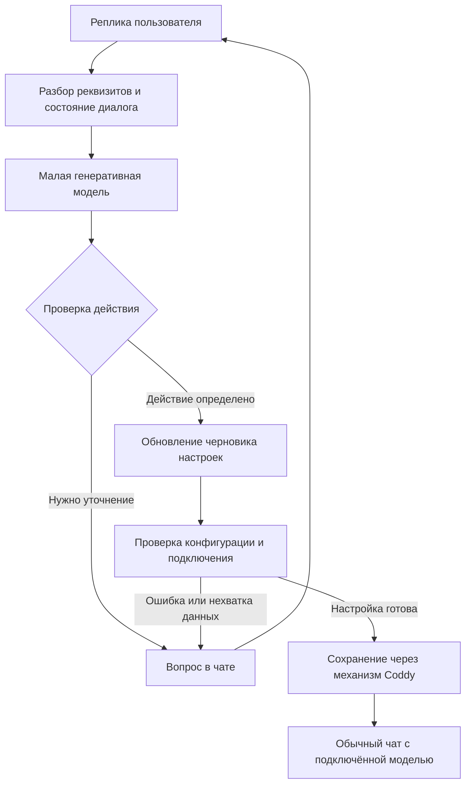

# Микромодель для первичной настройки Coddy

Локальный помощник, который на чистой установке понимает русское описание провайдера, уточняет недостающие настройки и вызывает инструменты конфигурации, технически реализуем. Диапазон 100–200 млн параметров — разумная цель для эксперимента. Для такой модели не обязательны ни GPU на машине пользователя, ни тернарные веса, ни подключение к внешней LLM. Встраивание в бинарь и отдельная загрузка весов — оба рабочих варианта доставки.

При этом пока не доказано, что конкретная модель этого размера надёжно решит задачу Coddy. Репозиторий содержит исследование и проект, но не обученную модель и не результаты проверки понимания команд. Его сильная часть — существующий механизм изменения конфигурации. Самый существенный недостаток выводов — оценка другого продукта: ускорителя отдельных правок при уже доступной большой модели. Для первичной настройки через диалог ограничения нужно пересмотреть.

Исследование учитывает приоритет малого размера: основной диапазон — 100–200M, допустимы как дообучение, так и обучение с нуля. Модели крупнее рассмотрены только как контроль качества или опубликованные аналоги. Проверены рабочее дерево `coddy-tinyllm` поверх коммита `30e8512` и соседний `coddy-agent` на `76700e4`; состояние источников — 13 сентября 2026 года. Уже существовавшие изменения README, обзора, раздела обучения и CPU-бенчмарка сохранены.

Подтверждённые факты, расчёты и предлагаемые эксперименты ниже разделены. Размеры в MB означают десятичные мегабайты, MiB — двоичные. Числа параметров сами по себе не определяют размер файла или расход RAM.

Главное расхождение с проектом

В [постановке задачи](../../docs/01-problem.md) диалог, объяснения и циклы вызова инструментов прямо исключены. После двух неудач предусмотрена передача запроса обычной LLM. В [политике доступных полей](../../docs/03-architecture.md) ключи провайдера и адреса API отнесены к запрещённой для маленькой модели поверхности. Именно эти поля нужны для подключения первой модели.

Такое ограничение понятно для необязательного ускорителя внутри работающего агента. Для первоначальной настройки оно создаёт замкнутый круг: подключить провайдера может только уже подключённый провайдер. Поэтому вывод «достаточно правил, а модель должна оправдать экономию вызовов» нельзя переносить на этот сценарий без новой проверки.

Низкая частота `config_set` в сессиях одного уже настроенного Coddy тоже не измеряет полезность первоначального подключения. Здесь метрика — доля людей, завершивших подключение, время до первого успешного ответа и число ручных исправлений. Однократная операция может быть основной причиной, по которой человек начал пользоваться приложением или отказался от него.

| Свойство | Проект в репозитории | Помощник для чистой установки |
|---|---|---|
| Исходное состояние | Есть обычный агент и запасной путь к LLM | Рабочего провайдера может не быть |
| Вход | Одна команда на изменение настроек | Описание, реквизиты, список моделей, последующие уточнения |
| Ответ | Список UCI-команд либо отказ | Вопрос, обновление черновика, результат проверки подключения |
| Основные поля | В основном отдельные настройки | `providers`, `models`, `agent.model` |
| Ошибка понимания | Передача большой модели | Уточнение или пошаговая форма в том же интерфейсе |
| Критерий пользы | Частота правок и выигрыш во времени | Успешная первоначальная настройка |

Что подтвердилось в выводах

Работа через короткие структурированные действия подходит задаче лучше, чем необходимость каждый раз переписывать весь YAML. Coddy уже умеет разбирать `set`, `add_list`, `del_list`, `delete`, применять пакет изменений, сохранять предыдущее состояние и откатываться. Проверка имеющихся тестов подтвердила, в частности, первый commit при отсутствующем файле, rollback и отсутствие записи при dry-run. Это готовая основа исполнителя, но не доказательство правильности будущих решений модели.[^c1]

Грамматика и проверка результата действительно полезны. Однако грамматика ограничивает форму ответа и доступные значения; она не доказывает, что выбран нужный провайдер или правильно понято отрицание. Это различие уже описано в части документов проекта и должно остаться в итоговой архитектуре. Официальная реализация llama.cpp поддерживает GBNF и преобразование поддерживаемого подмножества JSON Schema в грамматику.[^s1]

Специализация малых генеративных моделей на вызовах функций имеет опубликованные подтверждения. Google показывает для FunctionGemma 270M рост результата Mobile Actions с 58% до 85% после дообучения. Авторы отдельно предупреждают, что это основа для специализированного вызова функций, а не готовый собеседник; опубликованные проверки ограничены английскими запросами.[^s2]

distil labs сообщает для LFM2.5-350M рост эквивалентности вызовов инструмента с 61,4% до 98% в задаче shell-команд после обучения на 5 тыс. синтетических примеров. Это результат разработчика обучающего сервиса в определённой задаче, а не измерение на Coddy. Он подтверждает перспективность подхода, но не гарантирует аналогичные 98% при 100M, русском языке и другой схеме инструментов.[^s3]

Тернарное представление действительно уменьшает хранение весов линейных слоёв. При этом embeddings, выходная проекция, коэффициенты масштабирования, токенизатор и рабочая память остаются частью системы. Идеальные 1,585 бита на трит нельзя умножить на число всех параметров и объявить результат размером готового приложения. Направление рассуждений `experiments/bitness.py` верное; его результаты остаются расчётом, а не измерением экспортированного GGUF.[^r1]

Что требует исправления или более узкой формулировки

| Утверждение | Результат проверки |
|---|---|
| «Продукт — rules engine; модель только оптимизация» | Не следует для первоначальной настройки. Разговорный интерфейс до подключения провайдера имеет самостоятельную ценность. Правила полезны как контроль и запасной интерфейс. |
| «Единственные малые генеративные тернарные веса — TriLM» | Неполный обзор: опубликованы RuBit-LLama-63M и Bitnet-Llama-70M. Их наличие не означает готовности к чату или настройке.[^s4][^s5] |
| «Под 1B только Qwen заслуживает рассмотрения для русского» | Слишком сильное исключение: существуют ruGPT3-small около 125M и ruT5-small 65M. Их пригодность к действиям требует дообучения и сравнения.[^s6][^s7] |
| «Diff-форматы невозможны ниже 3B» | Diff-XYZ показывает трудности конкретных моделей на изменениях кода. Это не доказательство невозможности обучить меньшую модель узкому формату конфигурации.[^s8] |
| «Генеративную модель нельзя дообучать на CPU» | Неверно как общий вывод. Расчёт проекта касается большой программы полного дообучения; опубликованный CPU-пилот с LoRA на 1,5B занял около пяти часов.[^s9] |
| «Тернарность необходима, чтобы встроить модель» | Нет такого технического ограничения. Вопрос определяется допустимым размером поставки и RAM. Модель 100–200M в Q4 уже может быть достаточно компактной. |
| «Скорость тернарной модели будет выше в 1,85 раза» | Такой коэффициент нельзя переносить между процессорами, размерами, ядрами вычислений и длинами запросов. Приведённое в обзоре отношение относится к одному режиму замера.[^s10] |
| «Grammar гарантирует schema validity» | Это всё ещё написано в `docs/06-eval.md`, хотя `docs/03-architecture.md` уже ограничивает гарантию синтаксисом и кандидатами. Документы противоречат друг другу. |
| «Схема проверяется при каждой загрузке» | Текущий обычный loader и UCI dry-run используют типизированную конфигурацию и проверки полей. Отдельная проверка встроенной JSON Schema находится в пути `config.Check`; автоматическую эквивалентность этих проверок код не подтверждает.[^c2] |

В BitNet Distillation в обзоре допущена конкретная ошибка чтения таблицы: 88,01 → 88,17 для Qwen3-0.6B — результат MNLI, а не среднее по MNLI/QNLI/SST-2. В статье есть классификация и суммаризация, но нет русской первоначальной настройки или проверки вызовов инструментов при 100–200M. Это аргумент в пользу эксперимента с тернарной дистилляцией, а не обещание сохранить качество в нашем режиме.[^s11]

Сам пример с Kubernetes заслуживает более осторожного пересказа. 91,5% — это 183 успешных ответа из 200 синтетических тестовых примеров, близких к обучающему распределению. Авторы не выполняли серверную проверку Kubernetes. Существенную часть прироста дали изменения режима вывода; использовались 1,5B и LoRA, то есть этот результат не относится к моделям меньше миллиарда параметров. Работа полезна, но вывод README о доказанном «production quality» переносит её результат слишком далеко.[^s9]

Diff-XYZ проверяет применение diff, обратное применение и построение diff по двум версиям кода; в выборке файлы от 40 до 1 000 строк. В качестве осторожной рекомендации выбрать более простой выходной язык это уместный источник. В качестве запрета на любые diff при малом размере — нет. Для Coddy всё равно целесообразен структурированный план действий, потому что исполнитель уже может строить UCI и показывать diff без участия модели.[^s8]

В расчётах остались ошибки и неопределённости:

- `bitness.py` печатает «MB», но делит на `1024 * 1024`, то есть считает MiB. Он использует фиксированные 4,85 бита на параметр для `Q4_K_M`, хотя реальный экспорт смешивает типы тензоров. Скрипт даёт для SmolLM2-135M около 78 MiB, а опубликованный GGUF `Q4_K_M` у его изготовителя занимает около 105 MB. Следует измерять конкретный файл.[^r1][^s12]
- В §3.5 вычисление `8,8e11 FLOPs / 50–150 GFLOPS` даёт примерно 5,9–17,6 с, а не указанные далее 1–5 с. Это исправление арифметики исходных предпосылок, не новый замер скорости.
- При одинаковой длине входа сравнение 30M и 600M даёт двадцатикратное отношение параметров, не «два порядка» само по себе. Реальные encoder и decoder дополнительно отличаются вычислениями и способом обработки кандидатов.
- Стоимость «всей программы менее $15» не подтверждена локальным запуском этой программы. FLOP-оценка не включает все расходы sampling, оценки, подбора параметров и повторных опытов. Аренда GPU не равна полной стоимости получения работающего продукта.
- Утверждение «200M после 5B токенов не будет знать русского» не выводится из отношения токенов к параметрам. Результат зависит от состава корпуса и выбранной задачи. Такой объём не гарантирует качество, но и невозможность из него не следует.

Размер и кандидаты

Сто миллионов параметров — это примерно 200 MB только FP16-весов или 50 MB при идеальных четырёх битах на каждый параметр. Реальный файл больше идеального Q4-предела. Для первых опытов с моделями 100–200M разумно рассматривать ориентир порядка 70–150 MB весов, уточняя его экспортом; это оценка диапазона, не универсальное свойство любого архитектурного семейства.

Память процесса нужно измерять отдельно. Помимо весов нужны KV-cache или состояния encoder/decoder, рабочие буферы, токенизатор и сам runtime. Например, в опубликованном Google замере FunctionGemma с dynamic int8 файл занимал 288 MB, а peak RSS — около 551 MB. На CPU Samsung S25 Ultra с четырьмя потоками авторы получили 0,3 с до первого токена при 512 входных токенах. Эти числа показывают возможность CPU-применения, но не предсказывают скорость на i7-8750H или в Go-движке.[^s2]

| Кандидат | Размер | Почему стоит рассмотреть | Ограничение |
|---|---:|---|---|
| `HuggingFaceTB/SmolLM2-135M-Instruct` | 135M | Современная небольшая decoder-модель, готовая база для Q4 и SFT; Apache 2.0 | В основном английская; штатная поддержка function calling в карточке относится к варианту 1,7B, а не 135M.[^s13] |
| `ai-forever/rugpt3small_based_on_gpt2` | ≈125M | Уже обучена на русском; полезный контроль того, что даёт языковая база | Старое семейство GPT-2, нет готового поведения помощника настройки; перед поставкой нужно подтвердить условия распространения именно весов.[^s6] |
| `cointegrated/rut5-small` | 65M | Уже русскоязычная генеративная text-to-text модель, ещё меньше целевого диапазона; MIT | Это encoder–decoder, не готовый чат. Токенизатор и runtime для выбранного экспорта надо проверить отдельно.[^s7] |
| Собственная decoder-модель | 100–200M | Контроль словаря, корпуса, архитектуры и языка действий | Потребует обучения базовому пониманию русского, а не только нескольких тысяч примеров вызова инструмента |
| `SpectraSuite/TriLM_190M_Unpacked` | 190M | Настоящая опубликованная тернарная база; Apache 2.0 | Авторы прямо указывают отсутствие instruction/chat tuning; веса опубликованы распакованными в FP16.[^s14] |
| `igorktech/RuBit-LLama-63M` | 63,3M | Малый русскоязычный BitNet-эксперимент, пропущенный обзором | Нет результатов по нашему сценарию; F32 checkpoint и специальная замена слоёв, а не готовый компактный runtime.[^s4] |
| `google/functiongemma-270m-it` | 270M | Ближайший готовый образец архитектуры обучения вызовам функций | За пределами основного бюджета; русский не подтверждён опубликованными оценками, отдельные условия Gemma.[^s2] |
| `Qwen/Qwen3-0.6B` | 600M | Контроль: понять, ограничивает ли результат именно размер студента | Не соответствует приоритетному диапазону 100–200M; не предлагается обязательной поставкой.[^s15] |

ruT5-small особенно интересна, если задача сформулирована как преобразование «реплика + состояние настройки → действие». Её размер получен сокращением словаря mT5, и автор предупреждает о слабом исходном качестве перефразирования. Наличие русской базы не означает, что она уже умеет заполнять конфигурацию. Кроме того, урезанный словарь требует отдельной проверки латинских адресов, идентификаторов и редких символов. Ссылки на значения вместо их генерации существенно упрощают именно эту часть задачи.[^s7]

RuBit нельзя принимать за готовое решение на основании названия. Карточка заявляет обучение на 2,126 млрд токенов из darulm, но оставляет результаты оценки пустыми. Указание происхождения от 7B в автоматически сформированной карточке также не объясняет получение модели 63,3M. До выбора этой основы нужно проверить код обучения, представление весов, токенизатор, происхождение и качество. Она опровергает полноту списка в обзоре, но не доказывает существование пригодного русского чат-конфигуратора.[^s4]

Существуют и другие малые BitNet-опыты: автор Bitnet-Llama-70M прямо называет свою модель экспериментом и предупреждает о слабых ответах.[^s5] Обнаруженный `minima` на 91,4M — encoder, поэтому его нельзя считать ещё одной маленькой чат-моделью.[^s16] Для основной линии разработки подходящая работающая FP-модель полезнее непроверенной тернарной только из-за меньшего числа битов.

Как устроить диалог при 100–200M

Предлагается узкий режим «первоначальная настройка» с сохранением состояния. Модель выбирает смысл очередной реплики и следующее допустимое действие. Программа хранит реквизиты, список моделей, заполненные поля, ещё не отвеченные вопросы и результат последней проверки. Тогда «вторую сделай основной» интерпретируется относительно известного списка, а не требует повторной генерации всей конфигурации.



Для первого опыта достаточно нескольких действий: обновить описание провайдера, зарегистрировать список моделей, выбрать основную, запросить недостающее поле, проверить подключение. Запись файла выполняет контроллер после проверки полного черновика и по принятому в Coddy порядку подтверждения. Модель не должна самостоятельно решать, что успешная генерация JSON означает успешное подключение.

Пример запроса: «Вот OpenAI-совместимый сервер `https://llm.example.test/v1`, ключ, модели `acme/fast` и `acme/code`. Вторую поставь основной». Название протокола определяет `providers[].type`, а не компанию, владеющую сервером. Оригинальные model ID сохраняются как данные: не требуется, чтобы они были известны во время обучения.

Хост заранее сохраняет URL, ключ и список как объекты с внутренними ссылками. Один возможный ответ модели для обновления черновика:

```json
{
  "action": "update_setup",
  "provider_type": "openai",
  "base_url_ref": "url_1",
  "credential_ref": "secret_1",
  "models_ref": "list_1",
  "default_model_ref": "model_2"
}
```

Это предлагаемый протокол, его сейчас нет в Coddy. Ссылки создаёт программа, и декодер выбирает только среди реально доступных объектов. Сам ключ не требуется генерировать или передавать модели. При неоднозначном распознавании реквизитов контроллер уточняет, какое значение считать ключом или адресом. Это также устраняет необходимость копировать длинные случайные строки токен за токеном.

При отсутствии указания основной модели ответом становится вопрос «Какую модель сделать основной?». При просьбе «выбери самую дешёвую» без цен или правил выбора нельзя вычислить стоимость по названию; нужно запросить критерий либо воспользоваться заранее описанной политикой. Ограничение задачи не отменяет неоднозначность исходного текста.

Реплики «нет, оставь первую», «адрес прежний, ключ новый», «добавь ещё эту, старые не удаляй» должны входить в основной набор обучения. Состояние хранится в структурированном виде, а контекст модели получает текущий черновик, нужные варианты и короткую историю. Полная схема Coddy и весь предыдущий чат в каждом запросе не нужны.

Ответы для повторяющихся состояний можно выводить по шаблону: запрос ключа, ошибка авторизации, найденный список, подтверждённое сохранение. Это остаётся чатом с генеративной моделью внутри. Если требуется, чтобы модель сама сочиняла каждую реплику, такой вариант нужно оценивать отдельно: грамматически приятный текст не заменяет точность действия и требует дополнительной ёмкости модели.

Интеграция с существующим Coddy

Сейчас `Agent.getProvider` возвращает `no model configured`, если модель не выбрана. Поэтому локальный режим должен выбираться до входа в этот обычный путь. У режима первоначальной настройки должен быть собственный способ загрузить локальные веса, не зависящий от настроенных `providers`. После успешного подключения управление передаётся обычному агенту.[^c3]

Нижележащий механизм конфигурации уже поддерживает отсутствие файла. При этом инструменты верхнего уровня имеют дополнительные требования: `config_set` требует окружение с путём конфигурации, `config_commit` — функцию перезагрузки runtime. Возможны отдельный контроллер с собственным черновиком и обращением к конфигурационному backend либо специальная сессия настройки с корректно заполненным окружением инструментов. Простое добавление модели в список провайдеров само по себе первоначальную настройку не реализует.[^c1][^c4]

Провайдер, модели и основная модель должны проверяться как единая согласованная конфигурация. В Coddy модель ссылается на существующий provider, а при наличии моделей требуется корректный `agent.model`. В YAML используется именно `agent.model`; `default_agent_model` в отдельных API-ответах не следует принимать за ключ конфигурации. Для примера выше итоговые записи моделей имеют вид `lab/acme/fast` и `lab/acme/code`, где `lab` — имя созданного провайдера.[^c5]

Детерминированный компилятор действий формирует UCI-команды с правильным экранированием, а не модель пишет их вручную. Он же не допускает случайного удаления старых провайдеров при добавлении нового, повторного добавления записи и применения устаревшего черновика. Лимит «не более пяти UCI-команд» из проекта следует заменить ограничением на понятную операцию настройки: один провайдер и несколько моделей могут требовать больше пяти низкоуровневых изменений.

Запрет на все credentials для этого режима непригоден. Вместо него нужен узкий инструмент подключения провайдера: URL и секрет берутся из введённых реквизитов, ключ не появляется в тексте модели и показанном diff, а `api_key_command`, MCP-команды и произвольный shell не входят в эту операцию. Это ограничение исполнителя, которое не зависит от размера или «рассудительности» модели. Данные для дообучения должны содержать только искусственные секреты.

У Coddy уже есть `llm.ListModels`, а HTTP-обработчик использует его для настроенного провайдера. Для первоначальной настройки удобно переиспользовать нижний вызов с реквизитами черновика, до сохранения в активную конфигурацию. Если сервер не предоставляет список, программа принимает список пользователя. Проверка соединения и, при необходимости, короткого ответа должна возвращать явный результат; успешная запись YAML сама по себе не подтверждает работающий API.[^c6]

UCI dry-run нужно дополнить явной проверкой JSON Schema именно подготовленного документа. В текущем коде `parseValidateYAMLBytes` делает YAML-декодирование, применяет defaults и запускает `validateSubconfigs`; это не вызов `validateAgainstSchema`. Перенос логики проверки на candidate bytes или проверка изолированного временного файла позволит не проверять по ошибке старый файл на диске.[^c2]

Через pipe всё это передаётся обычным протоколом JSONL: запрос содержит реплику, состояние и допустимые действия, ответ — проверяемое действие или вопрос. Процесс модели можно держать живым на время настройки, чтобы не загружать веса на каждой реплике. Такой helper запускается Coddy автоматически и не требует отдельной ручной настройки Ollama или другого сервера.

Встраивание и загрузка весов

Проверена небольшая программа на `goccy/go-llama v0.5.0` из имеющегося module cache. Сборка выполнялась с `GOPROXY=off CGO_ENABLED=0 GOAMD64=v2`. Получен статически слинкованный Linux/amd64 ELF размером 23 743 469 байт, около 23,7 MB / 22,6 MiB, без удаления debug-информации. Инициализация движка в одном запуске заняла 7 мс; `BuildInfo` сообщает SIMD и threads. Веса при этом не загружались: это проверка встраивания движка, не benchmark LLM и не измерение холодного старта всей модели.[^r2]

Официальный проект описывает компиляцию llama.cpp в WebAssembly с последующим переводом в Go, без wasm-интерпретатора во время работы. Локальная версия предоставляет генерацию, токенизацию, chat template и grammar. Это снимает принципиальный вопрос «возможно ли без cgo», но проверка конкретных весов, памяти, отмены и платформ остаётся обязательной.[^s17]

| Поставка | Результат для пользователя | Инженерный компромисс |
|---|---|---|
| Веса внутри бинаря | После установки настройка работает без сети | Каждый релиз несёт модель; поведение загрузчика определяет дополнительные копии в RAM |
| Веса отдельным файлом рядом с бинарём | Также работает без сети, если файл включён в пакет | Проще независимо обновлять веса, нужен согласованный формат поставки |
| Загрузка при первой настройке | Компактный обычный дистрибутив | Для первого получения модели нужен интернет; после загрузки inference локальный |
| Отдельный загружаемый runner и веса | Локальная модель через pipe или localhost | Несколько артефактов по платформам, зато основной бинарь не связан с конкретным inference backend |

Все четыре варианта совместимы с CPU. Отдельный процесс также совместим с автономной работой после получения файлов. Поэтому pure Go, один файл поставки, тернарные веса и отсутствие облачной LLM — четыре независимых решения. Неудача pure-Go runtime не означает, что первоначальная настройка через локальную модель невозможна.

Для первого опыта предпочтительны отдельные веса и простой runner. После измерения качества и расхода памяти можно сделать пакет с встроенной или приложенной моделью. Манифест связывает версию протокола действий, модель, токенизатор, контрольную сумму и совместимость runtime. Скачивание должно поддерживать повтор после обрыва; при отсутствии сети нужен понятный путь к локальному файлу или форме настройки.

Если модель находится в `go:embed`, экономия места на диске не гарантирует экономию RAM: загрузчик может скопировать байты в свою память. У скачанного GGUF native runtime может использовать отображение файла в память, но это свойство выбранного загрузчика, а не формата поставки. Решение принимается по измерению peak RSS на реальном процессе.

Дообучение, обучение с нуля и тернарность

Первый эксперимент целесообразно сделать на существующей основе. Для decoder-LLM это сравнение SmolLM2-135M и русской ruGPT3-small; для проверки самого малого достаточного размера — ruT5-small. Языковая адаптация SmolLM2 и SFT вызовов функций решают разные проблемы: обучение форме ответа не гарантирует понимания разговорных русских инструкций. Если базовое понимание языка ограничивает результат, нужен дополнительный русский корпус либо другая основа.

В узкой первой версии допустимо обучать стабильные понятия провайдера, модели и основной модели. Требование проекта «любое новое поле полной схемы работает без дообучения» существенно труднее исходного сценария и не обязано входить в первый опыт. Совместимость с изменениями YAML можно поддерживать адаптером действий в Coddy, не заставляя маленькую модель изучать новые внутренние пути.

Начальный набор данных: 100–200 вручную продуманных диалогов для определения задачи, затем 2–5 тыс. проверенных обучающих эпизодов. Это предложенный масштаб пилота, не доказанный достаточный объём. Если результат растёт и видны конкретные пробелы, набор расширяется до 20–50 тыс. эпизодов. Сравниваются SFT и, где удобно, LoRA; RL и тернарная конверсия не нужны для ответа на первый вопрос о реализуемости.

Каждый эпизод должен содержать состояние до запроса, реплики, доступные ссылки на значения, правильное действие, ожидаемый результат проверки и следующее состояние. Учитель генерирует разнообразные формулировки вокруг заранее заданных правильных действий. Совпадение действий двух больших моделей не следует автоматически считать доказательством истинности; часть случаев проверяется вручную, особенно отрицания, исправления и неоднозначные просьбы.

Обучение с нуля также имеет смысл как отдельная проверяемая гипотеза. Пример архитектуры, укладывающейся в бюджет: 18 decoder-слоёв, hidden size 768, FFN 2 048, 12 attention heads и 4 KV-heads, словарь 16 384 токена, общие входные и выходные embeddings. Получается около 126M параметров. Это предлагаемый размерный эскиз, не обученная конфигурация и не рекомендация оптимальных гиперпараметров.

Такая основа позволяет выбрать русский корпус, компактный двуязычный словарь и короткий язык действий. Для идентификаторов и адресов нужны корректная обработка байтов и проверка точного переноса данных; внешние ссылки на значения уменьшают требования к словарю, но не заменяют хороший токенизатор. Сам размер словаря нельзя уменьшать без проверки понимания редких русских слов и технических обозначений.

TinyStories показывает, что модели меньше 10M могут генерировать связные истории при специально ограниченном языке и корпусе. Это подтверждение зависимости необходимого размера от задачи, а не доказательство качества на настройке провайдеров. В Coddy трудности другие: отрицания, указания на предыдущую реплику, неполные реквизиты и точный выбор действия.[^s18]

Стоимость обучения с нуля зависит от токенов и фактической производительности. Для ориентира `F ≈ 6ND` при 150M даёт следующую арифметику. 20–60 TFLOPS здесь — условная эффективная производительность, не паспортная скорость GPU и не измеренный результат конкретного стека.

| Токенов обучения | Расчёт FLOPs | Время только по формуле при 20–60 TFLOPS |
|---|---:|---:|
| 1 млрд | `9e17` | 4,2–12,5 ч |
| 5 млрд | `4,5e18` | 20,8–62,5 ч |
| 20 млрд | `1,8e19` | 83–250 ч |

Эта таблица не устанавливает, сколько токенов обеспечит нужное качество. Подготовка корпуса, оценка, checkpoints, неэффективность малых батчей и перебор вариантов увеличивают реальный срок. Для модели с нуля нужен корпус, обучающий языку, а затем диалоги с действиями; несколько тысяч SFT-примеров не дают того же основания, что готовая предобученная модель.

CPU следует рассматривать отдельно для обучения и применения. Уже имеющийся `train_bench.py` измеряет несколько шагов уменьшенных стеков со случайными входами, полной выходной проекцией и AdamW. Это полезный микробенчмарк вычислений, но не замер полного SFT существующей модели, не LoRA и не inference. Его экстраполяцию на десятки дней нельзя превращать в общий запрет CPU-дообучения. Опубликованный CPU-пилот подтверждает возможность небольшой адаптации; для частых опытов и обучения с нуля GPU остаётся практичнее.[^r3][^s9]

Тернарность стоит вводить после работающего результата в более высокой точности. При одинаковой архитектуре сравниваются FP/BF16, Q8, Q4 и обученный тернарный вариант. Для примера на 126M, если линейная часть занимает около 113M параметров, а embeddings — около 12,6M, `TQ2_0` для линейных весов и Q8 для embeddings дают примерно 42,6 MB только этих тензоров. Нормализации, токенизатор, метаданные и реализация экспорта добавляются сверху. Это расчёт потенциального размера, а не доступный checkpoint.

Обычное сохранение готовой FP-модели в двухбитный файл не равно тернарному обучению с сохранением качества. В качестве вариантов остаются QAT с самого начала, продолжение обучения после замены слоёв или дистилляция. Порог приемлемой потери должен определяться долей правильно завершённых настроек, а не только perplexity. Поддержка `tq1_0` и `tq2_0` в локальном kernel index проверена; она сама по себе не подтверждает совместимость любого checkpoint, скорость или сохранение семантики его архитектуры.[^r2][^s11]

Эксперимент, который ответит на основной вопрос

Нужна небольшая фиксированная проверка законченных диалогов, одинаковая для правил и всех моделей. Предлагаемый первый набор — 600 эпизодов; минимум 150 должны быть написаны людьми независимо от генератора обучающих данных. Число 600 — объём исследовательского сравнения, не сертификат надёжности.

| Сценарий | Эпизодов |
|---|---:|
| Полные реквизиты и выбор модели за одну реплику | 150 |
| Частичные реквизиты, несколько уточнений | 120 |
| Исправления, отрицания, сохранение существующих настроек | 100 |
| Новые имена моделей, URL и сочетания латиницы с кириллицей | 100 |
| Нет ключа, ошибка авторизации, API не отдаёт список, нет сети | 70 |
| Не относится к настройке или недостаточно определено | 60 |

Разделение train/test должно идти по семействам сценариев и формулировок, а не только по случайным строкам. Списки моделей, адреса и значения в тесте не встречаются в обучении. Несколько проверок выполняются с отсутствующим `config.yaml` и без ключей в окружении — именно это отличает первоначальную настройку от демонстрации на заранее подготовленной машине.

Главная метрика — правильная конечная конфигурация после полного диалога. Дополнительно учитываются лишние изменения, точность ссылок на реквизиты, уместность уточнений, число реплик до успеха, корректность реакции на ошибку инструмента и повторное применение той же просьбы. Частоту синтаксически корректных, но неверных действий нужно показывать отдельно.

Для инженерного сравнения измеряются полный размер поставки, peak RSS, время загрузки весов, обработка входа, генерация и полное время реплики на CPU. Нужны как минимум старый x86-ноутбук и более современная машина; число потоков и длина контекста фиксируются. По этим данным выбирается минимальная модель, выполняющая критерии, а не по известности семейства.

Для исследовательского перехода к интеграции можно задать ориентир не менее 95% завершённых однозначных сценариев после допускаемых уточнений и отдельно учитывать каждое неверное изменение. Это предлагаемый порог, а не достигнутый результат. Даже ноль ошибок на 600 независимых репрезентативных эпизодах даёт приблизительно 0,5% верхней 95-процентной границы частоты ошибки по правилу `3/n`; такой опыт не доказывает уровень 99,9%.

Практический выбор по результатам исследования: сначала проверить русский text-to-action на ruT5-small 65M и на decoder-модели 125–135M, сохранив простой контроллер диалога и существующий конфигурационный backend. Если принципиально нужен именно decoder-LLM, ruT5 остаётся контрольной альтернативой меньшего размера. Собственную 100–200M модель и тернарную версию имеет смысл сравнивать с этим измеренным основанием. Ни вариант с нуля, ни встраивание весов в бинарь исследование не исключает.

Воспроизводимая часть проверки

Повторный запуск `python3 experiments/schema_index/build_cards.py -o /dev/null` дал 208 карточек, из них 178 не типа `object`, 21 раздел и 35 744 символа. Оценка 9 929 токенов в скрипте основана на коэффициенте 3,6 символа на токен; это не измерение конкретным токенизатором. Повторный запуск `python3 experiments/bitness.py` воспроизвёл расчётную таблицу размеров.

Выборочные существующие тесты `coddy-agent/internal/config` прошли следующей командой:

```bash
go test ./internal/config -run 'Test(ParseUCICommandGrammar|CommitUCICommandsSelectorSetAppendAndDelete|CommitUCICommandsListOps|FirstCommitIntoMissingFileWritesSnapshotForRollback|CommitRollbackRestoresMissingFile|DryRunUCICommandsLeavesFileUntouched|LoadFromCLIWhenConfigMissing_AppliesDefaults)$' -count=1
```

Результат: `ok github.com/EvilFreelancer/coddy-agent/internal/config 0.006s`. Это проверка существующих операций конфигурации, а не полный тестовый набор Coddy и не тест будущего помощника. Сборка отдельной программы с `llama.New` и `BuildInfo` подтвердила статический CPU-runtime без загруженных весов.

Модели в этом исследовании не обучались; генерация ответов на локальной модели не измерялась. Поэтому готовность конкретного checkpoint к русскому диалогу, точность вызовов функций и задержки на целевом CPU остаются вопросами предложенного эксперимента. Полученный результат — проверка реализуемости, исправления к обзору и конкретная схема опыта, который измерит недостающие свойства.

Источники

[^r1]: Локальный репозиторий: [bitness.py](../../experiments/bitness.py), [описание архитектуры](../../docs/03-architecture.md), [README](../../README.md). Проверено 13.09.2026; таблицы размера в проекте расчётные.
[^r2]: Локально установленный `github.com/goccy/go-llama@v0.5.0`, зависимость `llamawasm2go@v0.4.0`; `llama.go`, `types.go`, `base/asm_kernels.json`. Собственная проверка сборки и `BuildInfo`, Linux/amd64, i7-8750H, 13.09.2026. Веса не загружались.
[^r3]: Локальный [train_bench.py](../../experiments/cpu_training/train_bench.py) и [расчёты обучения](../../docs/05-training.md). Код прочитан; длительный CPU-бенчмарк не повторялся.
[^c1]: Coddy, [`internal/config/uci.go`](../../../coddy-agent/internal/config/uci.go), [`path.go`](../../../coddy-agent/internal/config/path.go), [`path_test.go`](../../../coddy-agent/internal/config/path_test.go). Коммит `76700e4`, локальная проверка.
[^c2]: Coddy, [`internal/config/recovery.go`](../../../coddy-agent/internal/config/recovery.go), функция `parseValidateYAMLBytes`; [`check.go`](../../../coddy-agent/internal/config/check.go), функция `checkConfigBytes`; [`schema.go`](../../../coddy-agent/internal/config/schema.go). Обычная загрузка, UCI dry-run и отдельная JSON Schema-проверка прослежены по исходникам.
[^c3]: Coddy, [`internal/agent/react.go`](../../../coddy-agent/internal/agent/react.go), `getProvider`; [`internal/serve/runtime.go`](../../../coddy-agent/internal/serve/runtime.go), конструирование обычного runner.
[^c4]: Coddy, [`config_set.go`](../../../coddy-agent/internal/tools/config_set.go), [`config_commit.go`](../../../coddy-agent/internal/tools/config_commit.go), [`config_staging.go`](../../../coddy-agent/internal/tools/config_staging.go). Требования к окружению инструментов и транзакции.
[^c5]: Coddy, [`internal/config/resolve.go`](../../../coddy-agent/internal/config/resolve.go), `ResolveLLM` и `ValidateModelsProvidersAndAgent`; [`config.example.yaml`](../../../coddy-agent/config.example.yaml).
[^c6]: Coddy, [`external/httpserver/providers_models_http.go`](../../../coddy-agent/external/httpserver/providers_models_http.go), вызов `llm.ListModels` с реквизитами провайдера.
[^s1]: ggml-org. [llama.cpp — GBNF grammars](https://github.com/ggml-org/llama.cpp/blob/master/grammars/README.md). Официальная документация, проверено 13.09.2026.
[^s2]: Google DeepMind. [FunctionGemma model card](https://ai.google.dev/gemma/docs/functiongemma/model_card). Назначение, Mobile Actions, ограничения английской оценки и замеры S25 Ultra; проверено 13.09.2026.
[^s3]: distil labs. [Fine-Tuning Liquid’s LFM2.5: Accurate Tool Calling at 350M Parameters](https://www.distillabs.ai/blog/fine-tuning-liquids-lfm25-accurate-tool-calling-at-350m-parameters/). 30.03.2026. Результаты авторов эксперимента; независимое повторение на Coddy не выполнено.
[^s4]: igorktech. [RuBit-LLama-63M](https://huggingface.co/igorktech/RuBit-LLama-63M). Карточка автора и параметры опубликованного checkpoint; проверено 13.09.2026.
[^s5]: abideen. [Bitnet-Llama-70M](https://huggingface.co/abideen/Bitnet-Llama-70M). Авторское описание небольшого эксперимента; проверено 13.09.2026.
[^s6]: SberDevices / ai-forever. [ruGPT3-small](https://huggingface.co/ai-forever/rugpt3small_based_on_gpt2), [config.json](https://huggingface.co/ai-forever/rugpt3small_based_on_gpt2/blob/main/config.json). Размер около 125M соответствует опубликованной GPT-2-конфигурации: 12 слоёв, hidden 768, словарь 50 264. В [репозитории кода](https://github.com/ai-forever/ru-gpts/blob/master/LICENSE) — Apache 2.0; это не подмена проверки лицензии выбранного файла весов.
[^s7]: cointegrated. [ruT5-small](https://huggingface.co/cointegrated/rut5-small). 65M, сокращение словаря, MIT и ограничения исходной модели; проверено 13.09.2026.
[^s8]: JetBrains Research. [Diff-XYZ: A Benchmark for Evaluating Diff Understanding](https://arxiv.org/html/2510.12487v2). arXiv:2510.12487, версия 2. Задачи, размер файлов и результаты небольших Qwen2.5-Coder.
[^s9]: [Context-Instrumental Data Distillation for Kubernetes Manifest Generation: Method and Experimental Evaluation](https://arxiv.org/html/2605.25835v1). arXiv:2605.25835, версия 1, 2026. §§4–6, таблицы 1–2: CPU/LoRA, синтетический `test_200`, 183/200, время и ограничения проверки.
[^s10]: Microsoft Research. [Bitnet.cpp: Efficient Edge Inference for Ternary LLMs](https://arxiv.org/html/2502.11880v1). arXiv:2502.11880, 2025. Результаты зависят от ядра вычислений и платформы; они не являются замером приложения Coddy.
[^s11]: Microsoft Research. [BitNet Distillation](https://arxiv.org/html/2510.13998v1). arXiv:2510.13998, 2025. Таблица 1 — классификация, таблица 2 — суммаризация; число 88,01 относится к MNLI для 0.6B.
[^s12]: bartowski. [SmolLM2-135M-Instruct-GGUF — файлы](https://huggingface.co/bartowski/SmolLM2-135M-Instruct-GGUF/tree/main). Размер `Q4_K_M` в публикации изготовителя GGUF — около 105 MB; проверено 13.09.2026.
[^s13]: Hugging Face. [SmolLM2-135M-Instruct](https://huggingface.co/HuggingFaceTB/SmolLM2-135M-Instruct). Карточка модели: язык, обучение, лицензия, различия вариантов; проверено 13.09.2026.
[^s14]: SpectraSuite / Nolano. [TriLM_190M_Unpacked](https://huggingface.co/SpectraSuite/TriLM_190M_Unpacked); [Spectra](https://arxiv.org/html/2407.12327), 2024. Предобученная тернарная основа без instruction/chat tuning.
[^s15]: Qwen Team. [Qwen3-0.6B](https://huggingface.co/Qwen/Qwen3-0.6B). Многоязычная decoder-модель с режимом без thinking; проверено 13.09.2026.
[^s16]: ProCreations. [Minima](https://huggingface.co/ProCreations/minima). Карточка описывает encoder, а не генератор текста; проверено 13.09.2026.
[^s17]: goccy. [go-llama](https://github.com/goccy/go-llama). Официальное описание движка; дополнено проверкой локальных исходников версии 0.5.0.
[^s18]: Ronen Eldan, Yuanzhi Li. [TinyStories: How Small Can Language Models Be and Still Speak Coherent English?](https://arxiv.org/abs/2305.07759). 2023. Результаты на ограниченном английском языке историй, не на вызовах инструментов.
